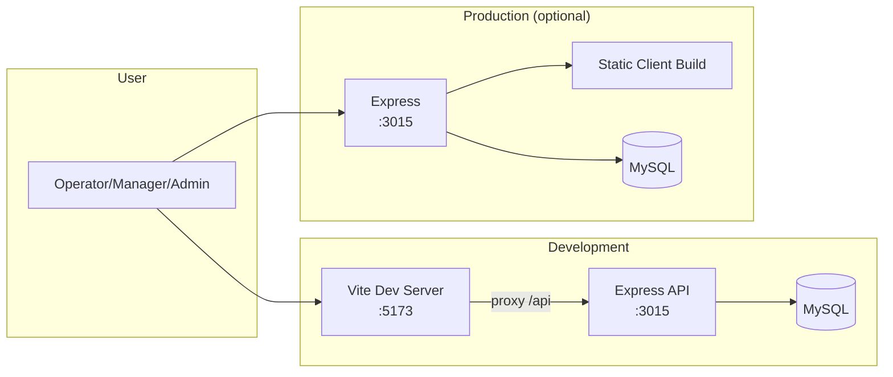
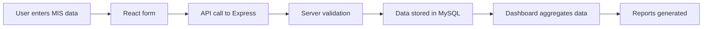
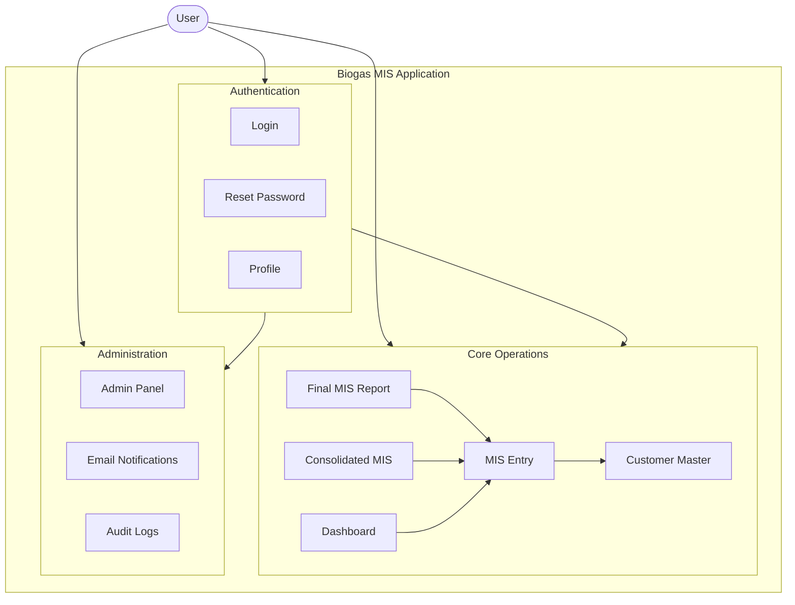
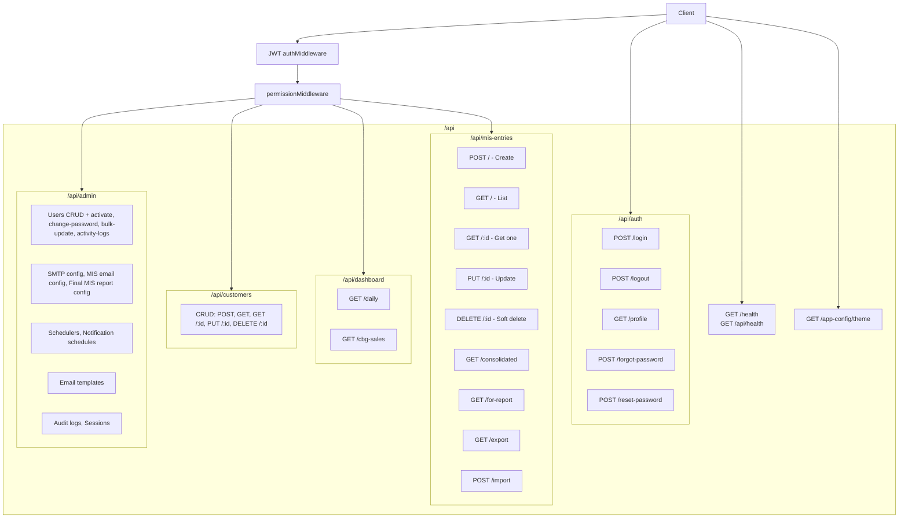

# Industrial Biogas Plant MIS — System Documentation

**Document Type:** Technical System Documentation  
**Classification:** Internal  
**Application:** Industrial Biogas Plant Management Information System (MIS)

---

## Document Control

| Attribute | Value |
|-----------|--------|
| **Version** | 2.0 |
| **Status** | Released |
| **Last Updated** | March 2025 |
| **Author** | Technical Team |
| **Reviewed By** | — |
| **Approved By** | — |

### Revision History

| Version | Date | Author | Description |
|---------|------|--------|-------------|
| 1.0 | March 2025 | Technical Team | Initial system documentation |
| 2.0 | March 2025 | Technical Team | Enterprise format; added architecture diagrams, data flow, module hierarchy, API architecture, database relationship explanation; integrated SREL_Details screenshots |

---

## Table of Contents

1. [Executive Summary](#1-executive-summary)
2. [System Overview](#2-system-overview)
3. [Technology Stack](#3-technology-stack)
4. [System Architecture](#4-system-architecture)
5. [Data Flow](#5-data-flow)
6. [Module Hierarchy](#6-module-hierarchy)
7. [API Architecture](#7-api-architecture)
8. [Database Schema & Relationships](#8-database-schema--relationships)
9. [Application Modules](#9-application-modules)
10. [Dashboard Module](#10-dashboard-module)
11. [MIS Entry Module](#11-mis-entry-module)
12. [Customer Master Module](#12-customer-master-module)
13. [Sales Tracking](#13-sales-tracking)
14. [Fuel Utilization](#14-fuel-utilization)
15. [Reports](#15-reports)
16. [Roles and Access Control](#16-roles-and-access-control)
17. [Security](#17-security)
18. [UI Screens & Screenshots](#18-ui-screens--screenshots)
19. [Future Improvements](#19-future-improvements)
20. [Conclusion](#20-conclusion)
21. [API Endpoints Reference](#21-api-endpoints-reference)

---

## 1. Executive Summary

The **Industrial Biogas Plant MIS** is an enterprise web application for managing day-to-day operations, production metrics, sales, and compliance of an industrial biogas plant. It replaces manual spreadsheets with a centralized system for daily MIS entry, approval workflow, reporting, and analytics. The system serves plant operators, managers, and administrators with role-based access and provides auditability through logs and email notifications.

---

## 2. System Overview

### 2.1 Purpose

The system centralizes data entry, reporting, and analytics for:

- Plant production monitoring  
- Raw material tracking  
- Biogas and CBG production metrics  
- Fertilizer production and sales  
- Fuel usage (Petrol, Diesel)  
- Sales tracking (CBG, FOM, LFOM)  
- Customer management  
- Utilities and HSE monitoring  

### 2.2 Business Capabilities

| Area | Description |
|------|-------------|
| **Plant production monitoring** | Daily/shift-wise production entries with digesters, feed, and biogas metrics |
| **Raw material tracking** | Cow dung, old/new press mud, stock, purchases, and consumption |
| **Biogas production metrics** | Raw biogas (per digester), flared gas, gas yield |
| **CBG production** | Compressed Biogas produced, quality (CH4, CO2, H2S, O2, N2), conversion ratio, stock, sold |
| **Fertilizer production** | FOM produced, inventory, sold, lagoon liquid, loose FOM, revenues |
| **Fuel usage** | Petrol and Diesel consumption per customer |
| **Sales tracking** | CBG sales by customer; FOM/LFOM revenue tracking |
| **Customer management** | Master data for customers (CBG, FOM, LFOM, Petrol, Diesel types) |
| **Utilities monitoring** | Electricity consumption, specific power consumption |
| **HSE monitoring** | Safety LTI, near misses, first aid, reportable incidents, MTI, fatalities |

### 2.3 Business Problem Solved

- Manual spreadsheets replaced by a single system for daily MIS entry, approval workflow, and reporting.  
- Data consistency through validated forms, unique date+shift constraints, and role-based permissions.  
- Auditability via audit logs, user activity logs, and email notifications.  
- Decision support via dashboard and Final MIS Report with configurable date filters.

---

## 3. Technology Stack

### 3.1 Frontend

| Technology | Version / Usage |
|------------|-----------------|
| **React** | 19.x |
| **TypeScript** | ~5.8 |
| **Vite** | 7.x (build & dev server) |
| **React Router** | 7.x |
| **Material-UI (MUI)** | 5.x (@mui/material, @mui/icons-material, @mui/x-date-pickers) |
| **React Hook Form** | 7.x (MIS form state) |
| **Axios** | HTTP client for API |
| **Recharts** | Charts (e.g. Final MIS) |
| **date-fns** | Date handling |
| **notistack** | Snackbar notifications |

### 3.2 Backend

| Technology | Version / Usage |
|------------|-----------------|
| **Node.js** | Runtime |
| **Express.js** | 4.x – REST API, routing, middleware |
| **Sequelize** | 6.x – ORM for MySQL |
| **MySQL** | Database (via mysql2 driver) |
| **JWT** | jsonwebtoken – authentication |
| **bcrypt** | Password hashing |
| **nodemailer** | Email (SMTP) |
| **node-cron** | Scheduled jobs (reminders, final MIS report) |
| **multer** | File upload (MIS import) |
| **xlsx** | Excel import/export |
| **helmet** | Security headers |
| **morgan** | HTTP logging |

### 3.3 Architectural Pattern

The application follows a **three-tier architecture**: React SPA (presentation) → Express REST API (business logic) → MySQL (data persistence). All API routes are under `/api`; authentication uses JWT (Bearer token).

---

## 4. System Architecture

### 4.1 System Architecture Diagram

The following diagram illustrates the high-level system architecture and the flow of requests from the user to the database.

```mermaid
flowchart TB
    subgraph Client["Presentation Layer"]
        Browser[Web Browser]
        SPA[React SPA<br/>Vite / Static]
        Browser --> SPA
    end

    subgraph API["Application Layer - Express API"]
        GW[API Gateway /api]
        Auth[authMiddleware<br/>JWT Verify]
        Perm[permissionMiddleware<br/>Resource + Action]
        Auth --> Perm
        GW --> Auth
        
        subgraph Routes["Route Groups"]
            R1[/auth]
            R2[/mis-entries]
            R3[/dashboard]
            R4[/customers]
            R5[/admin]
        end
        Perm --> Routes
    end

    subgraph Data["Data Layer"]
        ORM[Sequelize ORM]
        MySQL[(MySQL Database)]
        ORM --> MySQL
    end

    SPA -->|HTTPS/HTTP<br/>Bearer JWT| GW
    Routes --> ORM
```

**Layer summary:**

| Layer | Components | Responsibility |
|-------|------------|----------------|
| **Presentation** | React SPA, Vite (dev) / static build (prod) | UI, routing, form state, API calls with JWT |
| **Application** | Express, authMiddleware, permissionMiddleware, route handlers | Authentication, authorization, business logic, validation |
| **Data** | Sequelize, MySQL | Persistence, transactions, schema |

### 4.2 Deployment View



- **Development:** Client runs on Vite (e.g. port 5173); API on Express (e.g. port 3015); Vite proxies `/api` to Express.  
- **Production:** With `SERVE_CLIENT=true`, Express serves the built client from `client/out` and handles all non-API routes with `index.html`.

### 4.3 Server vs Frontend Responsibilities

| Server (Express) | Frontend (React) |
|------------------|-------------------|
| Login, JWT issue/verify, refresh, forgot/reset password | Login form, token storage, 401 → redirect to /login |
| Permission checks (resource + action); Admin bypass | Protected routes; menu visibility by permission |
| MIS CRUD, submit/approve/reject, import/export | MIS list and form; draft/submit/approve/reject actions |
| Dashboard aggregation (period/date range) | Dashboard filters and KPI cards |
| Customer CRUD | Customer list and create/edit dialog |
| User management, SMTP, email config, schedulers, templates | Admin and Notification config screens |
| Audit and email logging | Audit log viewer |
| Cron: reminder scheduler, final MIS report email | — |

---

## 5. Data Flow

### 5.1 Data Flow Diagram

End-to-end flow for a typical MIS entry: from user action to database and back to dashboard/reports.

```mermaid
sequenceDiagram
    participant U as User
    participant React as React Frontend
    participant API as Express API
    participant DB as MySQL

    U->>React: Open MIS Entry / Fill form
    React->>React: Validate (client)
    U->>React: Save draft / Submit
    React->>API: POST /api/mis-entries or PUT /api/mis-entries/:id
    Note over React,API: Authorization: Bearer &lt;JWT&gt;
    API->>API: authMiddleware (JWT)
    API->>API: permissionMiddleware (mis_entry create/update)
    API->>API: Parse & validate body
    API->>DB: BEGIN TRANSACTION
    API->>DB: Upsert mis_daily_entries + child tables
    API->>DB: Replace mis_cbg_sales, mis_fuel_utilized
    API->>DB: INSERT audit_logs
    API->>DB: COMMIT
    API->>React: 200 OK
    React->>U: Success message / redirect

    U->>React: Open Dashboard
    React->>API: GET /api/dashboard/daily?period=month
    API->>DB: SELECT entries + includes (date range)
    DB->>API: Rows
    API->>API: Aggregate (sum/avg)
    API->>React: { summary, trends }
    React->>U: Display KPI cards
```

### 5.2 Simplified Data Flow (Process View)



### 5.3 Key Data Flows

1. **Authentication:** User → Login form → `POST /api/auth/login` → Validate credentials → Issue JWT → Frontend stores token and user.  
2. **MIS entry create/update:** User → MIS form → `POST/PUT /api/mis-entries` → Transaction: main entry + all child sections (raw materials, feed tank, digesters, SLS, biogas, CBG, sales, fuel, etc.) → Audit log.  
3. **Dashboard:** User → Dashboard → `GET /api/dashboard/daily?period=...` → Server loads entries in range → Aggregates (feed, raw biogas, CBG produced/sold, FOM, electricity, HSE) → Returns summary and trends.  
4. **Reports:** User → Final MIS / Consolidated → `GET /api/mis-entries/for-report` or `/consolidated` → Server returns entries or aggregated data → Frontend displays and/or exports to Excel.

---

## 6. Module Hierarchy

### 6.1 Module Hierarchy Diagram

The following diagram shows the application modules and their logical grouping.



### 6.2 Module Summary Table

| Module | Purpose | Key Components |
|--------|---------|-----------------|
| **Dashboard** | KPIs for selected period (day/week/month/year/custom) | `DashboardPage`, `misService.getDashboardData` |
| **MIS Entry** | Daily/shift production data entry and workflow | `MISEntryPage`, `MISFormView`, `MISListView`, section components, `misController` / `misControllerExtensions` |
| **Customer Master** | Maintain customers for sales and fuel | `CustomerPage`, `customerService`, `customerController` |
| **Final MIS Report** | Date-filtered report and Excel export | `FinalMISPage`, `getEntriesForReport`, xlsx export |
| **Consolidated MIS** | Aggregated view (v1 and v2) | `ConsolidatedMISViewPage`, `ConsolidatedMISV2Page`, `getConsolidatedData` |
| **Admin Panel** | Users, SMTP, email config, schedulers, app theme | `AdminPage`, `adminController`, `userController`, `adminService` |
| **Email Notifications** | Notification schedules and reminders | `NotificationConfigPage`, `reminderScheduler`, `schedulerService` |
| **Audit Logs** | View system audit trail | `AuditLogsPage`, `adminController.getAuditLogs` |
| **Authentication** | Login, logout, profile, password reset | `LoginPage`, `ResetPasswordPage`, `AuthContext`, `authController` |

---

## 7. API Architecture

### 7.1 API Architecture Diagram

The API is organized by route groups under the `/api` prefix. All protected routes pass through authentication and then permission checks (except health and public config).



### 7.2 API Design Principles

| Principle | Implementation |
|-----------|----------------|
| **Single base path** | All APIs under `/api`; health also at `/health` on router |
| **Authentication** | Bearer JWT in `Authorization` header; issued via `POST /api/auth/login` |
| **Authorization** | Per-route `permissionMiddleware(resource, action)`; Admin/SuperAdmin bypass |
| **Request format** | JSON for most endpoints; `multipart/form-data` for MIS import |
| **Response format** | JSON; Excel blob for export and import-template |
| **Idempotency** | PUT and DELETE are idempotent; POST for create and workflow (submit/approve/reject) |

### 7.3 Route Groups Summary

| Group | Base path | Auth | Purpose |
|-------|-----------|------|---------|
| Health / Config | `/api/health`, `/api/app-config/theme` | No (health, theme public) | Health check; theme for app load |
| Auth | `/api/auth/*` | Mixed (login/public vs profile) | Login, logout, profile, forgot/reset password, create user |
| MIS Entries | `/api/mis-entries`, `/api/mis-entries/:id`, etc. | Yes + permission | CRUD, workflow, import/export, consolidated, for-report |
| Dashboard | `/api/dashboard/daily`, `/api/dashboard/cbg-sales` | Yes | Dashboard summary and CBG breakdown |
| Customers | `/api/customers` | Yes + permission | Customer CRUD |
| Admin | `/api/admin/*` | Yes + permission | Users, SMTP, config, schedulers, notifications, templates, audit |
| Form config | `/api/mis/form-config` | Yes, config:read | Roles, permissions, SMTP, schedulers for form |

---

## 8. Database Schema & Relationships

### 8.1 Database Relationship Explanation

The database is **MySQL**, accessed via **Sequelize ORM**. The design is **normalized** with clear ownership and referential integrity:

- **Identity & access:** `users` belong to one `roles`. Permissions are enforced primarily through **user-level** assignments in `user_permissions` (user_id, permission_id). Role–permission mapping in `role_permissions` supports default role permissions; the application checks user permissions first, then Admin/SuperAdmin bypass.
- **MIS hierarchy:** Each daily MIS record is one row in `mis_daily_entries` (date, shift, status, created_by). All production and operational data for that entry are stored in **child tables** linked by `entry_id` (foreign key to `mis_daily_entries.id`). On hard delete of an entry, child rows are removed via CASCADE or explicit deletes. This keeps one logical “MIS entry” as one parent plus many child sections (raw materials, feed mixing tank, digesters, SLS, raw biogas, raw biogas quality, compressed biogas, compressors, fertilizer, utilities, manpower, plant availability, HSE). Sales and fuel are **many-to-many in practice**: multiple rows per entry in `mis_cbg_sales` and `mis_fuel_utilized`, each referencing a `customer_id`.
- **Customers:** `customers` is a standalone master table (name, type, email, phone, address, GST, PAN, status) with soft delete. It is referenced by `mis_cbg_sales` and `mis_fuel_utilized` to attribute sales and fuel usage to a customer.
- **Audit and email:** `audit_logs` stores user actions (user_id, action, resource_type, resource_id, old/new values). `email_logs` can reference an audit log and entity for traceability of sent emails.

### 8.2 Entity Relationship Diagram

```mermaid
erDiagram
    users ||--o{ mis_daily_entries : "created_by"
    users }o--o{ permissions : "user_permissions"
    roles ||--o{ users : "role_id"
    roles }o--o{ permissions : "role_permissions"

    mis_daily_entries ||--|| mis_raw_materials : "entry_id"
    mis_daily_entries ||--|| mis_feed_mixing_tank : "entry_id"
    mis_daily_entries ||--o{ mis_digester_data : "entry_id"
    mis_daily_entries ||--|| mis_sls_data : "entry_id"
    mis_daily_entries ||--|| mis_raw_biogas : "entry_id"
    mis_daily_entries ||--|| mis_raw_biogas_quality : "entry_id"
    mis_daily_entries ||--|| mis_compressed_biogas : "entry_id"
    mis_daily_entries ||--|| mis_compressors : "entry_id"
    mis_daily_entries ||--|| mis_fertilizer_data : "entry_id"
    mis_daily_entries ||--|| mis_utilities : "entry_id"
    mis_daily_entries ||--|| mis_manpower_data : "entry_id"
    mis_daily_entries ||--|| mis_plant_availability : "entry_id"
    mis_daily_entries ||--|| mis_hse_data : "entry_id"
    mis_daily_entries ||--o{ mis_cbg_sales : "entry_id"
    mis_daily_entries ||--o{ mis_fuel_utilized : "entry_id"

    customers ||--o{ mis_cbg_sales : "customer_id"
    customers ||--o{ mis_fuel_utilized : "customer_id"

    users ||--o{ audit_logs : "user_id"

    users {
        int id PK
        string name
        string email
        string password
        int role_id FK
        boolean is_active
    }

    roles {
        int id PK
        string name
        string description
    }

    permissions {
        int id PK
        string name
        string resource
        string action
    }

    mis_daily_entries {
        int id PK
        date date
        enum shift
        enum status
        int created_by FK
    }

    customers {
        int id PK
        string name
        string type
        string email
        string status
    }

    mis_cbg_sales {
        int id PK
        int entry_id FK
        int customer_id FK
        float quantity
    }

    mis_fuel_utilized {
        int id PK
        int entry_id FK
        string fuel_type
        int customer_id FK
        float quantity
    }
```



### 8.3 Core Tables

| Table | Purpose |
|-------|---------|
| users | Users (name, email, password, role_id, is_active, is_custom_perm) |
| roles | Roles (name, description) |
| permissions | Permissions (name, description, resource, action) |
| user_permissions | User–Permission many-to-many (user_id, permission_id) |
| role_permissions | Role–Permission (role_id, permission_id) |
| customers | Customer master (name, type, email, phone, address, gst_number, pan_number, status); soft delete |
| mis_daily_entries | Main MIS entry (date, shift, status, review_comment, created_by) |

### 8.4 MIS Child Tables (entry_id → mis_daily_entries.id)

| Table | Purpose |
|-------|---------|
| mis_raw_materials | Raw materials summary |
| mis_feed_mixing_tank | Feed mixing tank |
| mis_digester_data | Digester rows (multiple per entry) |
| mis_sls_data | SLS machine |
| mis_raw_biogas | Raw biogas |
| mis_raw_biogas_quality | Raw biogas quality |
| mis_compressed_biogas | CBG |
| mis_compressors | Compressors |
| mis_fertilizer_data | Fertilizer |
| mis_utilities | Utilities |
| mis_manpower_data | Manpower |
| mis_plant_availability | Plant availability |
| mis_hse_data | HSE |
| mis_cbg_sales | CBG sales (entry_id, customer_id, quantity) |
| mis_fuel_utilized | Fuel utilized (entry_id, fuel_type, customer_id, quantity) |

### 8.5 Other Tables

| Table | Purpose |
|-------|---------|
| audit_logs | user_id, action, resource_type, resource_id, old_values, new_values, ip_address, user_agent |
| email_logs | recipient, subject, status, error_message, sent_at, audit_log_id, entity_type, entity_id |
| password_reset_tokens | Forgot/reset password flow |
| user_activity_logs | User activity (e.g. login) |
| NotificationSchedule, EmailScheduler, EmailTemplate, SMTPConfig, MISEmailConfig, FinalMISReportConfig, AppConfig | Config and email/scheduling |

---

## 9. Application Modules

*(See [Section 6.2 Module Summary Table](#62-module-summary-table) for the concise module list.)*

Application modules are: Dashboard, MIS Entry, Customer Master, Final MIS Report, Consolidated MIS, Admin Panel, Email Notifications, Audit Logs, and Authentication. Each is documented in the sections that follow where relevant.

---

## 10. Dashboard Module

### 10.1 Purpose

The dashboard provides an at-a-glance view of plant performance over a chosen period (daily, weekly, monthly, yearly, or custom date range).

### 10.2 Metrics Displayed

| Metric | Source | Unit |
|--------|--------|------|
| **Total Feed Amount** | Sum of cow_dung_qty + pressmud_qty + permeate_qty + water_qty from Feed Mixing Tank (values entered in tons) | tons (direct sum) |
| **Total Raw Biogas** | Sum of total_raw_biogas from Raw Biogas | m³ |
| **CBG Produced** | Sum of produced from Compressed Biogas | kg |
| **CBG Sold** | Sum of cbg_sold from Compressed Biogas (clickable for breakdown) | kg |
| **FOM Produced** | Sum of fom_produced from Fertilizer | kg |
| **FOM Sold** | Sum of sold from Fertilizer | kg |
| **Electricity Consumption** | Sum of electricity_consumption from Utilities | kWh |
| **HSE Incidents** | Sum of safety_lti and near_misses from HSE | count |

### 10.3 Aggregation Logic

- Backend: `GET /api/dashboard/daily` (query params: `period`, or `startDate` and `endDate`).  
- Entries in the date range are loaded with includes: rawBiogas, compressedBiogas, fertilizer, utilities, plantAvailability, hse, feedMixingTank.  
- Totals and averages are computed in memory; response includes `summary` and `trends`.  
- CBG sales breakdown: `GET /api/dashboard/cbg-sales` returns per-customer quantities for the same period.

---

## 11. MIS Entry Module

The MIS Entry module captures daily (or shift-wise) plant data in one entry per date+shift. Each entry has a main record (`mis_daily_entries`) and multiple child sections in separate tables.

### 11.1 Entry-Level Fields

| Field | Type | Purpose |
|-------|------|---------|
| date | DATEONLY | Entry date |
| shift | ENUM | 'Shift-1', 'Shift-2', 'General' |
| status | ENUM | draft, submitted, under_review, approved, rejected, deleted |
| review_comment | TEXT | Reviewer comment (e.g. on reject) |
| created_by | INT | User ID of creator |

**Business rule:** Unique constraint on `(date, shift)`.

### 11.2 Sections Summary

| Section | Table | Purpose |
|---------|--------|---------|
| Summary of Raw Materials | mis_raw_materials | Cow dung, press mud (old/new), stock, audit note |
| Feed Mixing Tank | mis_feed_mixing_tank | Cow dung, pressmud, permeate, water, slurry (qty, TS, VS, pH) |
| Digesters | mis_digester_data | Per-digester feeding, discharge, characteristics, health (HRT, OLR, etc.) |
| SLS Machine | mis_sls_data | Water, poly electrolyte, solution, slurry feed, wet cake, liquid, lagoon |
| Raw Biogas | mis_raw_biogas | Digester gas, total, flared, gas yield |
| Raw Biogas Quality | mis_raw_biogas_quality | CH4, CO2, H2S, O2, N2 % |
| Compressed Biogas | mis_compressed_biogas | Produced, quality, conversion ratio, stock, sold |
| Sales Details | mis_cbg_sales | Customer, quantity (CBG) |
| Fuel Utilized | mis_fuel_utilized | Fuel type (Petrol/Diesel), customer, quantity |
| Compressors | mis_compressors | Compressor 1/2 and total hours |
| Fertilizer | mis_fertilizer_data | FOM produced, inventory, sold, revenues (3 streams) |
| Utilities and Power | mis_utilities | Electricity consumption, specific power consumption |
| Manpower | mis_manpower_data | Refex SREL staff, third party staff |
| Plant Availability | mis_plant_availability | Working hours, scheduled/unscheduled downtime, total availability |
| Health, Safety & Environment | mis_hse_data | Safety LTI, near misses, first aid, reportable, MTI, other, fatalities |
| Remarks | entry.review_comment / form remarks | Free text |

### 11.3 Field Reference (Fields and Data Types)

The following tables list every field and its database type for each MIS Entry section. Types are as defined in the Sequelize models (MySQL equivalents: INT → INTEGER, FLOAT → DOUBLE, STRING → VARCHAR(255), TEXT → TEXT, DATEONLY → DATE, ENUM → ENUM).

#### 11.3.1 Main Entry (mis_daily_entries)

| Field | Type | Description |
|-------|------|-------------|
| id | INT | Primary key (auto) |
| date | DATEONLY | Entry date |
| shift | ENUM('Shift-1', 'Shift-2', 'General') | Shift |
| status | ENUM('draft', 'submitted', 'under_review', 'approved', 'rejected', 'deleted') | Workflow status |
| review_comment | TEXT | Reviewer comment (e.g. on reject) |
| created_by | INT | User ID of creator (FK → users.id) |
| created_at | TIMESTAMP | Created at |
| updated_at | TIMESTAMP | Updated at |

#### 11.3.2 Summary of Raw Materials (mis_raw_materials)

| Field | Type | Description |
|-------|------|-------------|
| id | INT | Primary key (auto) |
| entry_id | INT | FK → mis_daily_entries.id |
| cow_dung_purchased | FLOAT | Cow dung purchased |
| cow_dung_stock | FLOAT | Cow dung in stock |
| old_press_mud_opening_balance | FLOAT | Old press mud opening balance |
| old_press_mud_purchased | FLOAT | Old press mud purchased |
| old_press_mud_degradation_loss | FLOAT | Old press mud degradation loss |
| old_press_mud_closing_stock | FLOAT | Old press mud closing stock |
| new_press_mud_purchased | FLOAT | New press mud purchased |
| press_mud_used | FLOAT | Press mud used |
| total_press_mud_stock | FLOAT | Total press mud stock |
| audit_note | TEXT | Audit note |

#### 11.3.3 Feed Mixing Tank (mis_feed_mixing_tank)

| Field | Type | Description |
|-------|------|-------------|
| id | INT | Primary key (auto) |
| entry_id | INT | FK → mis_daily_entries.id |
| cow_dung_qty | FLOAT | Cow dung quantity |
| cow_dung_ts | FLOAT | Cow dung TS % |
| cow_dung_vs | FLOAT | Cow dung VS % |
| pressmud_qty | FLOAT | Pressmud quantity |
| pressmud_ts | FLOAT | Pressmud TS % |
| pressmud_vs | FLOAT | Pressmud VS % |
| permeate_qty | FLOAT | Permeate quantity |
| permeate_ts | FLOAT | Permeate TS % |
| permeate_vs | FLOAT | Permeate VS % |
| water_qty | FLOAT | Water quantity |
| slurry_total | FLOAT | Slurry total |
| slurry_ts | FLOAT | Slurry TS % |
| slurry_vs | FLOAT | Slurry VS % |
| slurry_ph | FLOAT | Slurry pH |

#### 11.3.4 Digesters (mis_digester_data) — multiple rows per entry

| Field | Type | Description |
|-------|------|-------------|
| id | INT | Primary key (auto) |
| entry_id | INT | FK → mis_daily_entries.id |
| digester_name | STRING | Digester name (e.g. Digester 01, 02, 03) |
| feeding_slurry | FLOAT | Feeding slurry |
| feeding_ts_percent | FLOAT | Feeding TS % |
| feeding_vs_percent | FLOAT | Feeding VS % |
| discharge_slurry | FLOAT | Discharge slurry |
| discharge_ts_percent | FLOAT | Discharge TS % |
| discharge_vs_percent | FLOAT | Discharge VS % |
| temp | FLOAT | Temperature |
| ph | FLOAT | pH |
| pressure | FLOAT | Pressure |
| lignin | FLOAT | Lignin |
| vfa | FLOAT | VFA |
| alkalinity | FLOAT | Alkalinity |
| vfa_alk_ratio | FLOAT | VFA/Alkalinity ratio |
| ash | FLOAT | Ash |
| density | FLOAT | Density |
| slurry_level | FLOAT | Slurry level |
| agitator_runtime | INT | Agitator runtime |
| agitator_condition | STRING | Agitator condition |
| hrt | FLOAT | HRT (hydraulic retention time) |
| vs_destruction | FLOAT | VS destruction |
| olr | FLOAT | OLR (organic loading rate) |
| balloon_level | FLOAT | Balloon level |
| foaming_level | FLOAT | Foaming level |
| remarks | TEXT | Remarks |

#### 11.3.5 SLS Machine (mis_sls_data)

| Field | Type | Description |
|-------|------|-------------|
| id | INT | Primary key (auto) |
| entry_id | INT | FK → mis_daily_entries.id |
| water_consumption | FLOAT | Water consumption |
| poly_electrolyte | FLOAT | Poly electrolyte |
| solution | FLOAT | Solution |
| slurry_feed | FLOAT | Slurry feed |
| wet_cake_prod | FLOAT | Wet cake produced |
| wet_cake_ts | FLOAT | Wet cake TS % |
| wet_cake_vs | FLOAT | Wet cake VS % |
| liquid_produced | FLOAT | Liquid produced |
| liquid_ts | FLOAT | Liquid TS % |
| liquid_vs | FLOAT | Liquid VS % |
| liquid_sent_to_lagoon | FLOAT | Liquid sent to lagoon |

#### 11.3.6 Raw Biogas (mis_raw_biogas)

| Field | Type | Description |
|-------|------|-------------|
| id | INT | Primary key (auto) |
| entry_id | INT | FK → mis_daily_entries.id |
| digester_01_gas | FLOAT | Digester 01 gas (m³) |
| digester_02_gas | FLOAT | Digester 02 gas (m³) |
| digester_03_gas | FLOAT | Digester 03 gas (m³) |
| total_raw_biogas | FLOAT | Total raw biogas (m³) |
| rbg_flared | FLOAT | Raw biogas flared (m³) |
| gas_yield | FLOAT | Gas yield |

#### 11.3.7 Raw Biogas Quality (mis_raw_biogas_quality)

| Field | Type | Description |
|-------|------|-------------|
| id | INT | Primary key (auto) |
| entry_id | INT | FK → mis_daily_entries.id |
| ch4 | FLOAT | CH4 % |
| co2 | FLOAT | CO2 % |
| h2s | FLOAT | H2S % |
| o2 | FLOAT | O2 % |
| n2 | FLOAT | N2 % |

#### 11.3.8 Compressed Biogas (mis_compressed_biogas)

| Field | Type | Description |
|-------|------|-------------|
| id | INT | Primary key (auto) |
| entry_id | INT | FK → mis_daily_entries.id |
| produced | FLOAT | CBG produced (kg) |
| ch4 | FLOAT | CH4 % |
| co2 | FLOAT | CO2 % |
| h2s | FLOAT | H2S % |
| o2 | FLOAT | O2 % |
| n2 | FLOAT | N2 % |
| conversion_ratio | FLOAT | Conversion ratio |
| ch4_slippage | FLOAT | CH4 slippage |
| cbg_stock | FLOAT | CBG stock (kg) |
| cbg_sold | FLOAT | CBG sold (kg) |

#### 11.3.9 Sales Details – CBG (mis_cbg_sales) — multiple rows per entry

| Field | Type | Description |
|-------|------|-------------|
| id | INT | Primary key (auto) |
| entry_id | INT | FK → mis_daily_entries.id |
| customer_id | INT | FK → customers.id |
| quantity | FLOAT | Quantity (kg) |
| created_at | TIMESTAMP | Created at |
| updated_at | TIMESTAMP | Updated at |

#### 11.3.10 Fuel Utilized (mis_fuel_utilized) — multiple rows per entry

| Field | Type | Description |
|-------|------|-------------|
| id | INT | Primary key (auto) |
| entry_id | INT | FK → mis_daily_entries.id |
| fuel_type | STRING | 'Petrol' or 'Diesel' |
| customer_id | INT | FK → customers.id |
| quantity | FLOAT | Quantity |
| created_at | TIMESTAMP | Created at |
| updated_at | TIMESTAMP | Updated at |

#### 11.3.11 Compressors (mis_compressors)

| Field | Type | Description |
|-------|------|-------------|
| id | INT | Primary key (auto) |
| entry_id | INT | FK → mis_daily_entries.id |
| compressor_1_hours | FLOAT | Compressor 1 hours |
| compressor_2_hours | FLOAT | Compressor 2 hours |
| total_hours | FLOAT | Total hours |

#### 11.3.12 Fertilizer (mis_fertilizer_data)

| Field | Type | Description |
|-------|------|-------------|
| id | INT | Primary key (auto) |
| entry_id | INT | FK → mis_daily_entries.id |
| fom_produced | FLOAT | FOM produced (kg) |
| inventory | FLOAT | Inventory |
| sold | FLOAT | Sold (kg) |
| weighted_average | FLOAT | Weighted average |
| revenue_1 | FLOAT | Revenue (FOM) |
| lagoon_liquid_sold | FLOAT | Lagoon liquid sold |
| revenue_2 | FLOAT | Revenue (lagoon liquid) |
| loose_fom_sold | FLOAT | Loose FOM sold |
| revenue_3 | FLOAT | Revenue (loose FOM) |

#### 11.3.13 Utilities and Power (mis_utilities)

| Field | Type | Description |
|-------|------|-------------|
| id | INT | Primary key (auto) |
| entry_id | INT | FK → mis_daily_entries.id |
| electricity_consumption | FLOAT | Electricity consumption (kWh) |
| specific_power_consumption | FLOAT | Specific power consumption |

#### 11.3.14 Manpower (mis_manpower_data)

| Field | Type | Description |
|-------|------|-------------|
| id | INT | Primary key (auto) |
| entry_id | INT | FK → mis_daily_entries.id |
| refex_srel_staff | INT | Refex SREL staff count |
| third_party_staff | INT | Third party staff count |

#### 11.3.15 Plant Availability (mis_plant_availability)

| Field | Type | Description |
|-------|------|-------------|
| id | INT | Primary key (auto) |
| entry_id | INT | FK → mis_daily_entries.id |
| working_hours | FLOAT | Working hours |
| scheduled_downtime | FLOAT | Scheduled downtime |
| unscheduled_downtime | FLOAT | Unscheduled downtime |
| total_availability | FLOAT | Total availability (%) |

#### 11.3.16 Health, Safety & Environment (mis_hse_data)

| Field | Type | Description |
|-------|------|-------------|
| id | INT | Primary key (auto) |
| entry_id | INT | FK → mis_daily_entries.id |
| safety_lti | INT | Safety LTI |
| near_misses | INT | Near misses |
| first_aid | INT | First aid |
| reportable_incidents | INT | Reportable incidents |
| mti | INT | MTI |
| other_incidents | INT | Other incidents |
| fatalities | INT | Fatalities |

### 11.4 Workflow

- **Create:** `POST /api/mis-entries` (permission: mis_entry create).  
- **Update:** `PUT /api/mis-entries/:id` (permission: mis_entry update). Approved entries editable only by Admin/SuperAdmin or configured approved editors.  
- **Submit:** `POST /api/mis-entries/:id/submit` (permission: mis_entry submit).  
- **Approve / Reject:** `POST .../approve` or `.../reject` with review_comment (permission: mis_entry approve).  
- **Delete:** `DELETE /api/mis-entries/:id` (soft delete).  
- **Hard delete:** `DELETE /api/mis-entries/:id/hard` (Admin/SuperAdmin only).

---

## 12. Customer Master Module

### 12.1 Purpose

Maintain a master list of customers used in CBG sales and fuel utilized.

### 12.2 Fields

| Field | Type | Description |
|-------|------|-------------|
| name | STRING | Customer name (required) |
| type | STRING | CBG, FOM, LFOM, Petrol, Diesel |
| email | STRING | Email (validated) |
| phone | STRING | Phone |
| address | TEXT | Address |
| gst_number | STRING | GST number |
| pan_number | STRING | PAN number |
| status | ENUM | active, inactive |

**Table:** `customers` (soft delete enabled).

### 12.3 CRUD

| Action | API | Permission |
|--------|-----|------------|
| Create | POST /api/customers | customer:create |
| List/Search | GET /api/customers?search=&status= | customer:read |
| Get by ID | GET /api/customers/:id | customer:read |
| Update | PUT /api/customers/:id | customer:update |
| Delete | DELETE /api/customers/:id | customer:delete |

Customers are used in MIS Entry in Sales Details (CBG) and Fuel Utilized.

---

## 13. Sales Tracking

- **CBG:** Tracked in `mis_cbg_sales` (quantity per customer per entry). Dashboard CBG Sold and CBG Sales Breakdown use this data.  
- **FOM/LFOM:** Tracked in `mis_fertilizer_data` (sold, revenue_1, lagoon_liquid_sold, revenue_2, loose_fom_sold, revenue_3). No per-customer FOM table in current schema.  
- Customer selection in MIS form uses active customers from Customer Master; optional “Add customer” if user has customer:create.

---

## 14. Fuel Utilization

- **Fuel types:** Petrol, Diesel (stored as string in `mis_fuel_utilized.fuel_type`).  
- **Fields:** entry_id, fuel_type, customer_id, quantity. Multiple rows per entry for multiple customers and/or fuel types.

---

## 15. Reports

- **Final MIS Report:** Date range filter (single/week/month/quarter/year/custom); data from `GET /api/mis-entries/for-report`; client-side aggregation and Excel export.  
- **Consolidated MIS:** Aggregated view from `GET /api/mis-entries/consolidated` (date range or financial year/quarter).  
- **Scheduled Final MIS Report Email:** Cron job runs at configured time; generates report and sends to configured recipients.

---

## 16. Roles and Access Control

### 16.1 Roles

| Role | Description |
|------|-------------|
| Admin | Full access (middleware bypass) |
| SuperAdmin | Same as Admin |
| Manager | MIS read/approve, config read, audit read |
| Operator | MIS create, read, update, submit |

### 16.2 Permission Model

- **Primary:** User-level permissions in `user_permissions`; assigned in Admin when creating/editing a user.  
- **Admin/SuperAdmin:** Bypass all permission checks.  
- **Resources:** mis_entry, user, role, config, audit, customer. **Actions:** create, read, update, delete, submit, approve, import, export (as applicable).  
- Customer permissions (customer:create/read/update/delete) are added via scripts and assigned to users as needed.

---

## 17. Security

- **Authentication:** JWT issued on login; verified by authMiddleware; Bearer token in header; 401 → logout and redirect to /login.  
- **Passwords:** Hashed with bcrypt before store.  
- **Authorization:** permissionMiddleware(resource, action); Admin/SuperAdmin bypass; approved-entry edit restricted to Admin or configured approved editors.  
- **API:** CORS configured; Helmet for headers; Sequelize parameterized queries.

---

## 18. UI Screens & Screenshots

Screenshots for the following screens are stored in the **SREL_Details** folder. Place PNG or JPG files with the names below so the documentation links resolve correctly. See `SREL_Details/README.md` for the full list.

### 18.1 Login (`/login`)

- **Purpose:** Authenticate user (email, password).  
- **Actions:** Login (`POST /api/auth/login`); links to Forgot password, Reset password.  
- **Post-login:** Redirect to /dashboard; token and user stored.


*Figure 1: Login screen. (Add screenshot as `SREL_Details/01-login.png`.)*

---

### 18.2 Dashboard (`/dashboard`)

- **Purpose:** Period-based production summary.  
- **Components:** Filter (Daily, Weekly, Monthly, Yearly, Custom); date pickers for Daily/Custom; KPI cards (Total Feed, Raw Biogas, CBG Produced/Sold, FOM Produced/Sold, Electricity, HSE Incidents).  
- **Data:** `GET /api/dashboard/daily`; CBG breakdown via `GET /api/dashboard/cbg-sales`.


*Figure 2: Dashboard with filter and KPI cards. (Add screenshot as `SREL_Details/02-dashboard.png`.)*

---

### 18.3 MIS Entry (`/mis-entry`)

- **List view:** Table of entries (date, shift, status, created by); Create, Import, Export template; Edit/View/Delete per row.  
- **Form view:** Sections: Raw Materials, Feed Mixing Tank, Digesters, SLS, Raw Biogas, Raw Biogas Quality, Compressed Biogas, Sales (CBG), Fuel Utilized, Compressors, Fertilizer, Utilities, Manpower, Plant Availability, HSE, Remarks. Actions: Save draft, Submit, Approve, Reject (by permission and status).


*Figure 3: MIS entry list. (Add screenshot as `SREL_Details/03-mis-entry-list.png`.)*


*Figure 4: MIS entry form (e.g. Raw Materials / Feed section). (Add screenshot as `SREL_Details/04-mis-entry-form.png`.)*

---

### 18.4 Customer Master (`/customers`)

- **Purpose:** CRUD customers.  
- **List:** Table with search and status filter; Add, Edit, Delete (by permission).  
- **Dialog:** Create/Edit with name, type (CBG, FOM, LFOM, Petrol, Diesel), email, phone, address, GST, PAN, status.


*Figure 5: Customer Master. (Add screenshot as `SREL_Details/05-customer-master.png`.)*

---

### 18.5 Final MIS Report (`/final-mis`)

- **Purpose:** View and export MIS for a date range.  
- **Filter:** Single day, week, month, quarter, year, custom.  
- **Content:** Tables from report data; Export to Excel.


*Figure 6: Final MIS Report. (Add screenshot as `SREL_Details/06-final-mis-report.png`.)*

---

### 18.6 Admin Panel (`/admin`)

- **Access:** Admin role only.  
- **Content:** User management, SMTP config, MIS email config, Final MIS report config, Schedulers, Notification schedules, Email templates, App theme.


*Figure 7: Admin Panel. (Add screenshot as `SREL_Details/07-admin-panel.png`.)*

---

### 18.7 Email Notifications (`/admin/notifications`)

- **Purpose:** Configure notification schedules and reminder emails.


*Figure 8: Email Notifications. (Add screenshot as `SREL_Details/08-notifications.png`.)*

---

### 18.8 Audit Logs (`/audit-logs`)

- **Purpose:** View audit trail. Data: `GET /api/admin/audit-logs` (audit:read).


*Figure 9: Audit Logs. (Add screenshot as `SREL_Details/09-audit-logs.png`.)*

---

### 18.9 Layout and Navigation

- **Layout:** Collapsible sidebar with logo; menu items: Dashboard, MIS Entry, Final MIS Report, Customer Master; Admin Panel and Email Notifications for Admin. Visibility by permission and role.  
- **Top bar:** User avatar/menu (profile, logout), session timer.  
- **Protected routes:** Wrapped with `ProtectedRoute`; unauthenticated → /login.  
- **Admin routes:** Wrapped with `AdminRoute` for /admin and /admin/notifications.

---

## 19. Future Improvements

- Role-based permission UI and consistent customer/dashboard permissions.  
- Dashboard filter option for approved entries only.  
- Richer analytics (trends, digester comparison, customer-wise sales).  
- Predictive maintenance alerts from historical data.  
- Mobile-friendly flows or PWA.  
- In-app alerts for HSE, low stock, thresholds.  
- FOM/LFOM per-customer sales table and reports if required.  
- Multi-plant support (plant/site dimension).

---

## 20. Conclusion

The **Industrial Biogas Plant MIS** is an enterprise web application that centralizes daily plant data, workflow (draft → submit → approve/reject), customer and sales tracking, fuel usage, utilities, and HSE. It uses a **React + Express + MySQL** stack with JWT authentication and user-level permissions. The system provides structured MIS entry, dashboard analytics, Final MIS and Consolidated reports, customer master, admin capabilities, and audit/email logging, and is suitable for industrial biogas plant operations, compliance reporting, and management decision-making.

---

## 21. API Endpoints Reference

Base path: **/api**. Authenticated routes require `Authorization: Bearer <token>` unless noted.

### 21.1 Health & Config

| Method | Path | Purpose | Auth |
|--------|------|---------|------|
| GET | /api/health | Health check | No |
| GET | /health | Health (router) | No |
| GET | /api/app-config/theme | Public theme config | No |
| GET | /api/mis/form-config | Form config (roles, permissions, SMTP, schedulers) | Yes, config:read |

### 21.2 Auth

| Method | Path | Purpose |
|--------|------|---------|
| POST | /api/auth/login | Login |
| POST | /api/auth/logout | Logout |
| POST | /api/auth/refresh | Refresh token |
| GET | /api/auth/profile | Current user profile |
| POST | /api/auth/create-user | Create user |
| POST | /api/auth/forgot-password | Forgot password |
| POST | /api/auth/reset-password | Reset password |

### 21.3 MIS Entries

| Method | Path | Purpose | Permission |
|--------|------|---------|------------|
| POST | /api/mis-entries | Create entry | mis_entry:create |
| GET | /api/mis-entries | List entries | mis_entry:read |
| GET | /api/mis-entries/consolidated | Consolidated data | mis_entry:read |
| GET | /api/mis-entries/for-report | Entries for report | mis_entry:read |
| GET | /api/mis-entries/import-template | Download Excel template | mis_entry:read |
| POST | /api/mis-entries/import | Import Excel | mis_entry:import |
| GET | /api/mis-entries/export | Export Excel | mis_entry:read |
| GET | /api/mis-entries/:id | Get one entry | mis_entry:read |
| PUT | /api/mis-entries/:id | Update entry | mis_entry:update |
| DELETE | /api/mis-entries/:id | Soft delete | mis_entry:delete |
| DELETE | /api/mis-entries/:id/hard | Hard delete | mis_entry:delete + Admin |
| POST | /api/mis-entries/:id/submit | Submit | mis_entry:submit |
| POST | /api/mis-entries/:id/review | Review | mis_entry:approve |
| POST | /api/mis-entries/:id/approve | Approve | mis_entry:approve |
| POST | /api/mis-entries/:id/reject | Reject | mis_entry:approve |

### 21.4 Dashboard

| Method | Path | Purpose | Query |
|--------|------|---------|-------|
| GET | /api/dashboard/daily | Dashboard summary & trends | period, startDate, endDate |
| GET | /api/dashboard/cbg-sales | CBG sales by customer | period, startDate, endDate |

### 21.5 Customers

| Method | Path | Purpose | Permission |
|--------|------|---------|------------|
| POST | /api/customers | Create customer | customer:create |
| GET | /api/customers | List/search | customer:read |
| GET | /api/customers/:id | Get one | customer:read |
| PUT | /api/customers/:id | Update | customer:update |
| DELETE | /api/customers/:id | Delete | customer:delete |

### 21.6 Admin (summary)

All under `/api/admin`, require auth and appropriate config/user/audit permission:

- **Users:** GET/POST /users, GET/PUT/DELETE /users/:id, POST /users/:id/activate, POST /users/:id/change-password, POST /users/bulk-update, GET /users/:id/activity-logs  
- **SMTP:** GET/POST /smtp-config, PUT /smtp-config/:id, POST /smtp-config/test  
- **MIS email:** GET/PUT /mis-email-config  
- **Final MIS report:** GET/PUT /final-mis-report-config, POST /final-mis-report-config/send-test  
- **App theme:** PUT /app-config/theme  
- **Schedulers:** GET/POST /schedulers, PUT /schedulers/:id  
- **Notification schedule:** GET/PUT /notification-schedule  
- **Notification schedules:** GET/POST /notification-schedules, PUT/DELETE /notification-schedules/:id  
- **Email templates:** GET/POST/PUT/DELETE /email-templates, POST test, POST preview, GET variables  
- **Audit:** GET /audit-logs, GET /sessions  

---

*End of Document*
